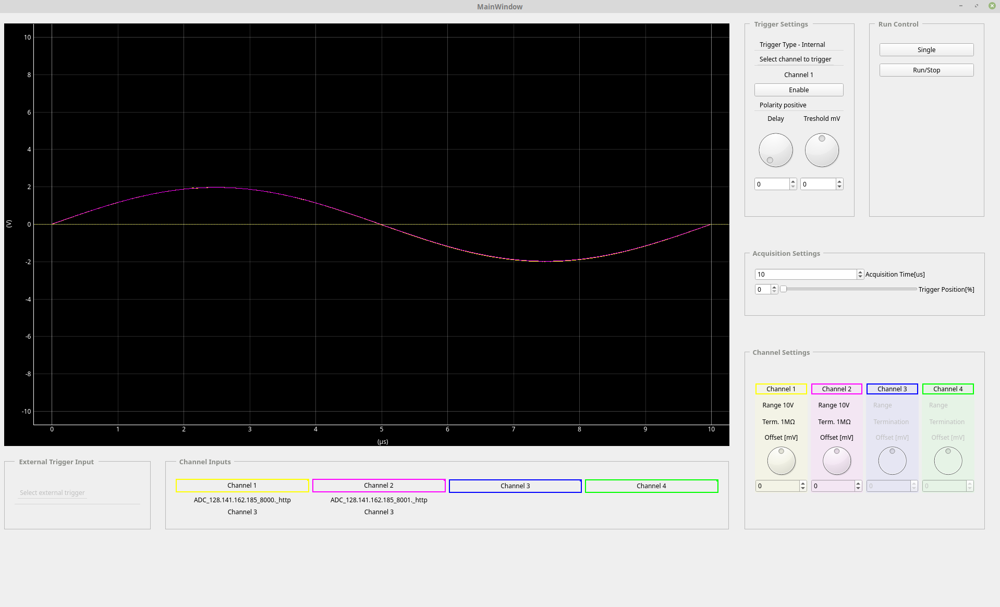
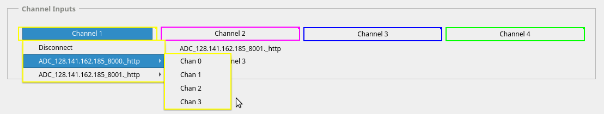
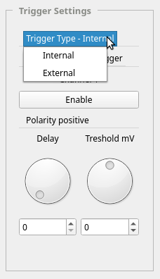
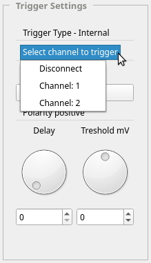
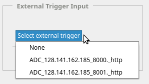
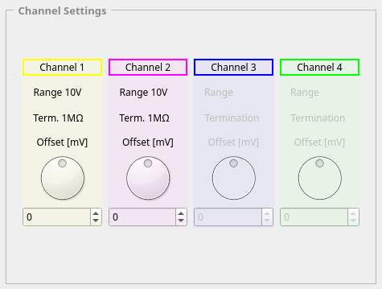
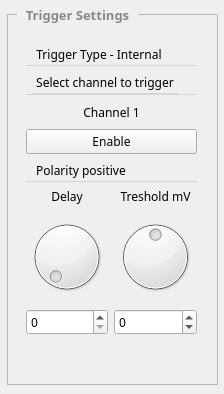
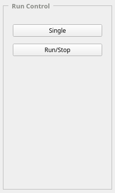
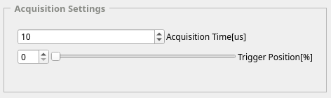

.. _usage:

Usage of the GUI
================

The GUI application is presented in :numref:`fig_gui`.

    
   Screenshot of the GUI application

Channels selection
------------------

Just like in standard oscilloscope, there is a possibility of observing up to
4 channels. Any channel of any available ADC can be connected to the particular
channel of the GUI. 

    
   Selection of GUI channels 

Triggers selection
------------------

The ADCs could be triggered either by external trigger pulse or when the signal
of the observed channel crosses the threshold value (internal trigger).

    
   Selection of trigger type 

Internal trigger
^^^^^^^^^^^^^^^^

If the internal trigger is selected, the GUI could be triggered on any channel
to which a signal is connected. 

    
   Selection of internal trigger 

External trigger
^^^^^^^^^^^^^^^^

If the external trigger is selected, the GUI could be triggered by the external
trigger input of any connected ADC.

    
   Selection of external trigger 

Channels settings
-----------------

Currently available channels settings are the following:

* range
* termination
* offset

    
   Channels settings 

Trigger settings
----------------

Currently available trigger settings are the following:

* polarity
* delay
* threshold (in case of internal trigger)

    
   Trigger settings 

Run control
---------------

There are two available modes:

* single acquisition
* continuous acquisition

    
   Run control 

Acquisition settings
--------------------

Acquisition settings allow modifying the acquisition time and position of the
trigger. Position of the trigger is given in percentage of the acquisition time.

    
   Acquisition settings 
