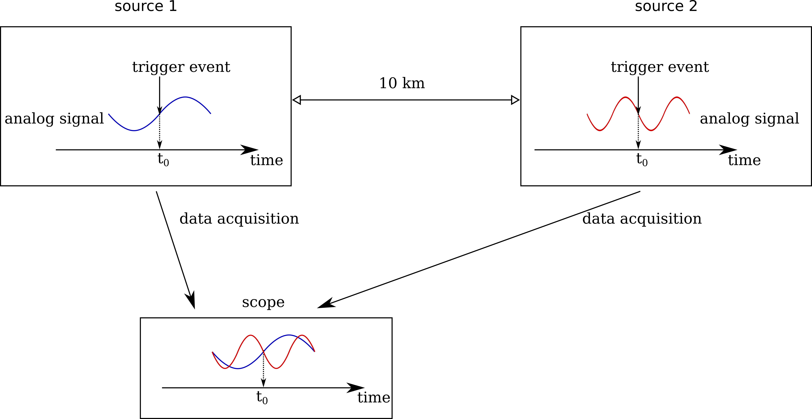

.. _introduction:

-----------
Introduction
-----------

The Distributed Oscilloscope (DO) is an application allowing to synchronously monitor analog signals in a distributed system, independently of the distance.

The idea of the DO is presented in :numref:`fig-problem-description`.

   
   Synchronous acqusition of distributed data 

Analog signals from various digitizers are time-stamped, aligned to the same moment in time and sent to the Graphical User Interfacei (GUI), to be displayed. The synchronization is obtained using the White Rabbit Trigger Distribution `(WRTD)  <https://www.ohwr.org/project/wrtd>`_ project.

Architecture
===========

The DO constits of three layers:

* `User Application`_
* `Server`_
* `Device Application`_

================
`User Application`_
================
There are currently two User Applications available:

* GUI --- it is designed to resemble standard oscilloscope.
* testbench --- it is used to test the Server and the Device Applications as well as to perform statistical measurements of data acquisition speed and of the precision of the synchronization.

The User Applications serve two purposes:

* Deviced configuration
* Collecting and processing the acquisition data

The Device Applications never communicate with the devices directly, always through the Server. This allows to hide all the implementation details and to provide common interface for various types of applications. 
The details how to write User Applications are described in section :ref:`user_applications`

================
`Server`_
================

The Server is a central unit responsible for managing all the connections, preprocessing the data and providing a common interface for connected applications. 

================
`Device Application`_
================

