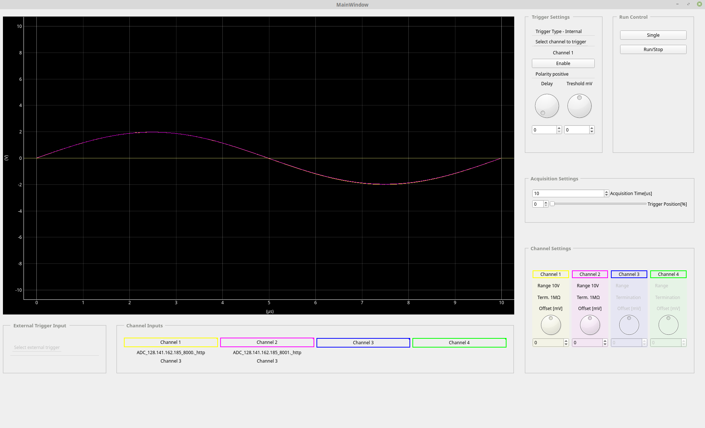
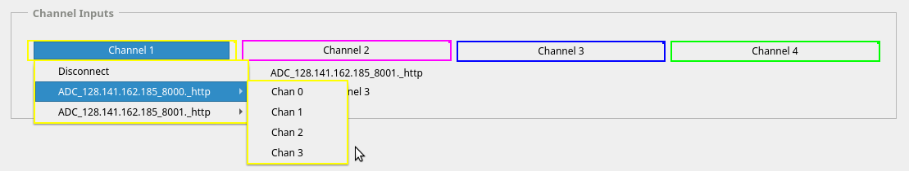
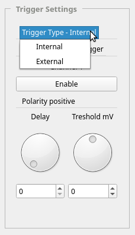
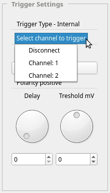
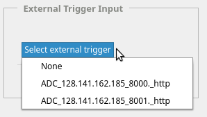
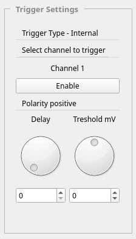
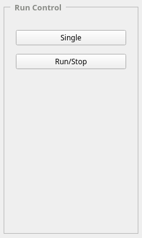
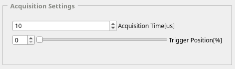

.. _usage:

Usage of the GUI
================

The GUI application is presented in :numref:`fig_gui`.

    
   Screenshot of the GUI application

Channels selection:
------------------

Just like in standard oscilloscope, there is a possibility of observing up to 4 channels. Channels from available ADCs could be connected to channels of the GUI. 

    
   Selection of GUI channels 

Triggers selection:
-----------------

    
   Selection of trigger type 

Internal trigger:
^^^^^^^^^^^^^^^^

    
   Selection of internal trigger 

External trigger:
^^^^^^^^^^^^^^^^

    
   Selection of external trigger 

Channels settings:
----------------

.. figure:: graphics/GUI_channels_settings.png
   :name: fig_gui_chann_sett
   :width: 120pt
   :align: center
   :alt: alternate text
   :figclass: align-center
    
   Channels settings 

Trigger settings:
----------------

    
   Trigger settings 

Run control:
---------------

    
   Run control 

Acquisition settings:
--------------------

    
   Acquisition settings 

.. todo::
    
    Make screenshots of all of the components of the GUI and explain shortly

